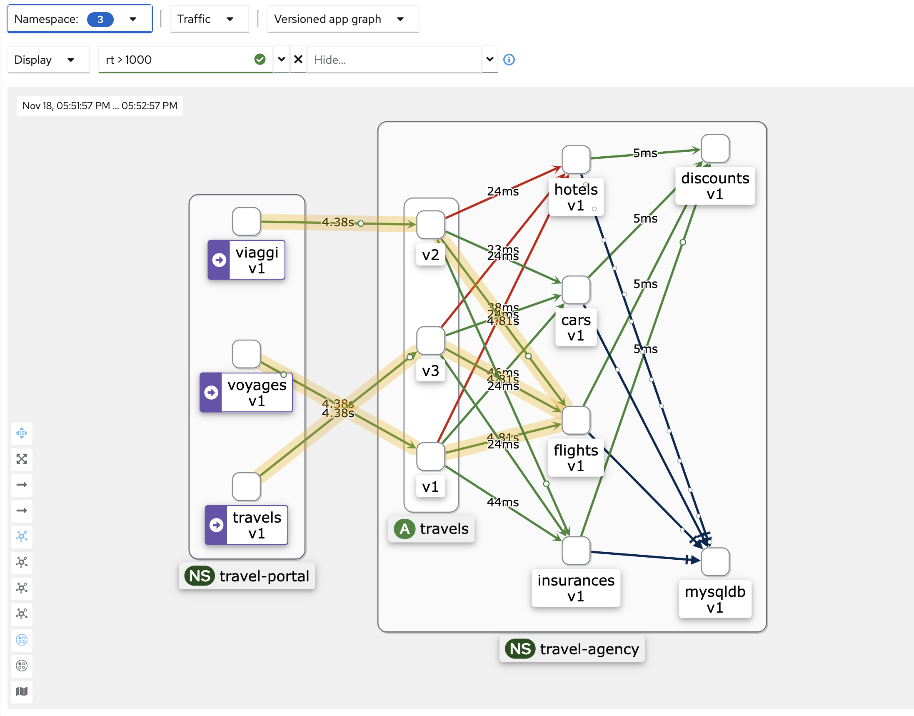
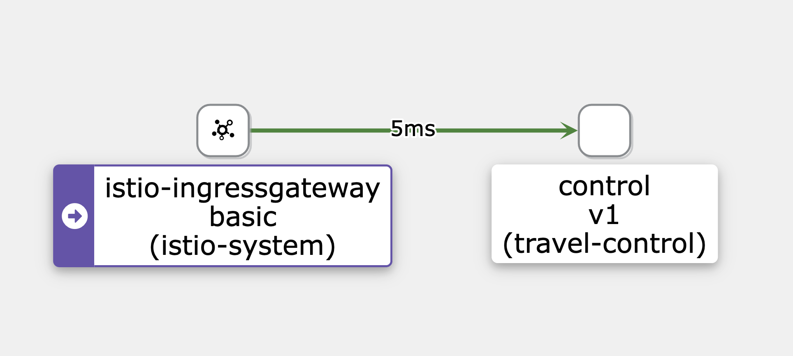

# Service Mesh Demo

This demo is a set of scripts that are based on the Travel Demo Tutorial from the [Kiali web-site](https://kiali.io/docs/tutorials/travels/01-prerequisites/).  You should read more about the [Travels Demo App](https://kiali.io/docs/tutorials/travels/02-install-travel-demo/#understanding-the-demo-application) in order to better show your demo. 

The general demo steps are explained below.  For those who are impatient and just want to show off OpenShift Service Mesh, run the following on any recent OpenShift 4 cluster, with system-admin privileges. 

```
./00-install-all.sh
```
This will install OpenShift Service Mesh (OSSM) from scratch.  The resulting Kiali graph, which eventually shows, can be used to explain many features and capabilities of OSSM.  

To uninstall OSSM and the demo app:

```
./99-uninstall-all.sh
```

Please see Troubleshooting below!


### Troubleshooting

### Alternative step-by-step Demo

Each of the scripts can be used one after the other, if needed.  The names of the scripts should be self-explanatory. 
You might choose to show the whole demo from scratch, installing the Operators and the mesh control plane and then the application etc, you can choose what you show yourself and what you just want to automate (using one or more of the scripts). 

- Scripts starting with '0' are those that setup, install and configure OSSM and the demo application. 
- Other scripts, starting with '1' and then '2' provide the configuration for each step of the demo.
- Scripts starting with '9' can be used to remove the demo app and the service mesh, if needed. 


Once Kiali is running, a URL is output which can be used to show Kiali and should be the focus of your demo. 
A longer Kiali URL is also output, which can be used to get straight to the Kaili graph that's useful for the demo (e.g. with animation, refresh of 10s and other settings set for you). 

Alternatively you can log into Kiali and complete the following, manually:

1. Select the 3 travel namespaces under 'Select Namespace' so the application shows up in the graph 
1. Activate traffic animation and deselect 'Service Nodes' in the 'Display' menu to make the graph less complicated!
1. Set the graph refresh rate to 'Every 10s" 
1. In the 'Find...' drop-down, select "rt > 1000" to highlight slow paths (run the ./2* scripts to activate the slowness). 

After several minutes you should see a similar graph in Kiali:



### Troubleshooting

Sometimes Kiali does not start and the route is missing:

```
Waiting for route/kiali .....
```

The only way I have found to fix this is to re-install the Service Mesh Control Plane:

```
./93-delete-smcp-basic.sh 
servicemeshcontrolplane.maistra.io "basic" deleted
Verifying deletion of all control-plane pods .... done
./02-install-smcp-basic.sh 
```


If the demo app graph does not show properly in Kilai (as below), restart the application pods:

{width=50%}

```
oc delete po --all -n travel-portal
oc delete po --all -n travel-agency
```
